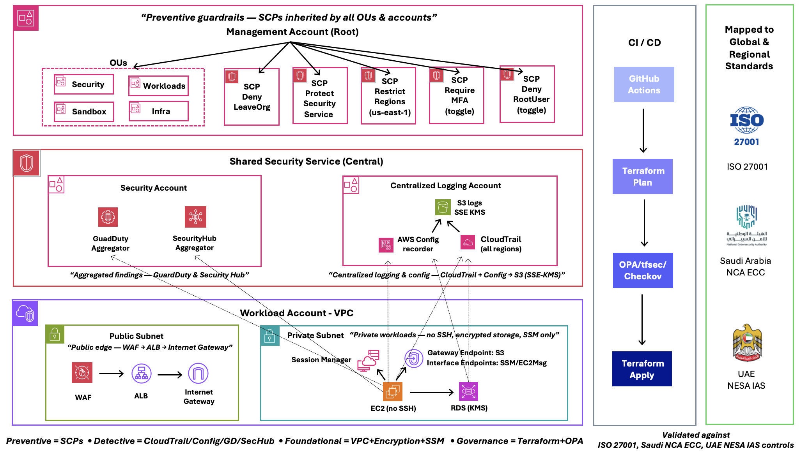

# AWS Multi-Framework Compliance-as-Code Baseline

> This open-core baseline demonstrates how to automate **identity, access, and compliance governance** across multi-account AWS environments using **Infrastructure-as-Code** and **Policy-as-Code**.

---

##  Key Capabilities

- **IAM Governance-as-Code** — Permission boundaries, MFA enforcement, and least-privilege policies.
- **Compliance-as-Code** — Controls mapped to ISO 27001, NIS2, and DORA requirements.
- **Continuous Validation** — Automated policy testing using OPA/Rego, tfsec, and Checkov.
- **Evidence Automation** — Generate version-controlled audit artifacts.
- **Multi-Cloud Extensibility** — Designed for AWS, extendable to Azure and GCP.

---

##  Sample Compliance Mapping

| Control ID | Description | Framework Reference | Terraform Implementation | Evidence Artifact |
|-------------|-------------|--------------------|--------------------------|-------------------|
| GCC-LOG-001 | Centralized Logging & Encryption | ISO 27001 A.12.4.1, DORA 9(2)(f) | aws_cloudtrail, aws_kms_key | OPA: cloudtrail_encryption_enabled |
| GCC-IAM-002 | IAM Governance | NIS2 Art.21(2)(b) | aws_iam_policy, permission_boundary.tf | OPA: iam_boundary_pass.rego |

> *This table is a limited preview.
> The full mapping library (100+ controls, 10+ frameworks) is proprietary and available under license.*

---

## Architecture Diagram

---

## CI/CD Security Gates

- Terraform validate → tfsec → Checkov → OPA test
- Fail-fast CI pipeline (GitHub Actions)
- Demonstrates automated control validation

---

### AWS Multi-Framework Compliance Baseline

by [Amina Jiyu An](https://www.linkedin.com/in/amina0806)

