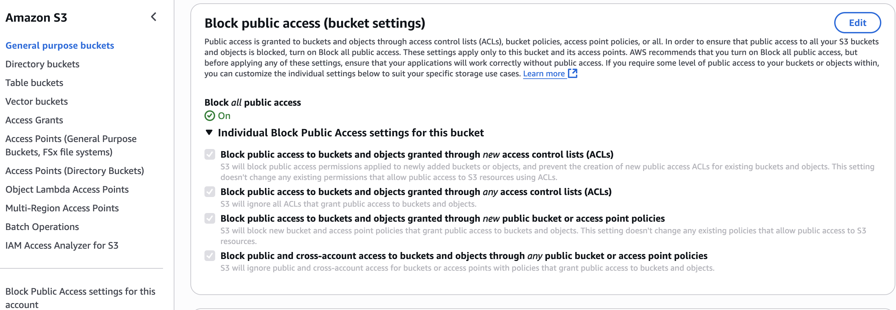

# Terraform AWS Secure Baseline — Portfolio Project


📘 **Overview**
This portfolio demonstrates how to design, codify, and document a **secure AWS baseline** using Terraform. It begins with the foundations — **remote state management** and **centralized logging** — and will later expand into full enterprise guardrails (Organizations, Config, Security Hub, IAM, Policy-as-Code).


---
📘 **What This Portfolio Demonstrates**
- **Secure IaC foundations**: reliable remote state with encryption and locking
- **Centralized audit logging**: CloudTrail → S3 + CloudWatch with KMS
- **Encryption by default**: CMKs with rotation enabled
- **Compliance readiness**: codified mappings to
  - Global: **CIS AWS Foundations**, **ISO/IEC 27001 Annex A**
  - Regional: **Saudi NCA Essential Cybersecurity Controls (ECC)**, **UAE NESA/IAS**
- **Evidence-based documentation**: console screenshots + Terraform code


---

📑 **ISO/IEC 27001 Annex A Coverage (so far)**

| Step | Controls Implemented |
|------|-----------------------|
| **Step 1** | A.8.20 Use of cryptography (S3 backend with SSE-KMS)<br>A.8.23 Information security in cloud services (remote state segregation)<br>A.8.16 Access control (DynamoDB state locking) |
| **Step 2** | A.12.4 Logging & monitoring (CloudTrail, CloudWatch)<br>A.8.20 Use of cryptography (CMK, SSE-KMS)<br>A.8.24 Data leakage prevention (Block Public Access, TLS-only)<br>A.8.16 Monitoring activities (log file validation, versioned bucket) |

📄 Full mappings:
- [docs/iso27001-mapping.md](docs/iso27001-mapping.md)
- [docs/cis-controls-coverage.md](docs/cis-controls-coverage.md)
- [docs/nca-ecc-mapping.md](docs/nca-ecc-mapping.md)
- [docs/nesa-mapping.md](docs/nesa-mapping.md)


<br>


🖼️ **Architecture Diagram**
`docs/architecture-diagram.png`

---

📂 **Project Structure**

---

<br>


### Step 1 — Remote State Backend
- **S3 bucket (SSE-KMS, versioning enabled)** for Terraform state storage
- **DynamoDB table** for state locking and consistency


---

### Screenshots

| Step | Screenshot |
|------|------------|
| ✅ S3 Backend Bucket (SSE-KMS + Versioning) |  |
| ✅ DynamoDB Table for State Locking |  |


---

### Security Highlights

- **Centralized remote state** → Terraform state stored in secure S3 bucket.
- **Integrity & consistency** → DynamoDB table prevents concurrent state changes.
- **Encrypted at rest** → Backend bucket encrypted with AWS KMS CMK.
- **Versioning enabled** → Rollback and tamper detection for state files.
- **Least privilege IAM** → Access to state backend scoped to pipeline role only.

---

### ISO/IEC 27001 Annex A Mapping

- **A.8.20 Use of cryptography** → State backend encrypted with KMS.
- **A.12.4 Logging & monitoring** → State versioning supports auditability.
- **A.5.23 Cloud security** → Enforced remote backend instead of local state.
- **A.8.16 Identity & access control** → IAM policies restrict access to state bucket/DDB.

---

### Saudi Arabia- NCA ECC (Essential Cybersecurity Controls) Mapping

- **ECC-1.2 Data Protection at Rest** → S3 backend encryption with KMS.
- **ECC-1.6 Secure Configuration Management** → Remote state ensures centralized control.
- **ECC-5.1 Access Control** → Scoped IAM policies on state bucket and DDB.
- **ECC-6.2 Audit Logging** → Versioning provides history of changes.

<br>
<br>


### Step 2 — Centralized Logging
- **CloudTrail (multi-region, global events, log file validation)**
- **S3 log bucket** (versioned, SSE-KMS CMK, Block Public Access, TLS-only policy)
- **CloudWatch Logs group** (KMS-encrypted, retention 365 days)


---

### Screenshots

| Step | Screenshot |
|------|------------|
| ✅ KMS CMK Created (Rotation Enabled) |  |
| ✅ Log Bucket Encryption (SSE-KMS) |  |
| ✅ S3 Block Public Access ON |  |
| ✅ Log Bucket Policy (TLS-only + enforce KMS) |  |
| ✅ CloudTrail Settings (Multi-Region, Validation, KMS) |  |
| ✅ CloudTrail Log Files in S3 (Proof) |  |

---

### Security Highlights

- **Organization-wide audit trail** → CloudTrail multi-region enabled.
- **Tamper-proof logging** → Log file validation + SSE-KMS encryption.
- **Centralized evidence storage** → S3 log bucket with versioning and lifecycle.
- **Defense in depth** → TLS-only bucket policy and enforced KMS key usage.
- **Default deny** → Block Public Access prevents accidental exposure.


---

### ISO/IEC 27001 Annex A Mapping

- **A.12.4 Logging & monitoring** → CloudTrail captures all management events.
- **A.8.20 Use of cryptography** → Logs encrypted with KMS CMK.
- **A.8.24 Data leakage prevention** → TLS-only + BPA policies on log bucket.
- **A.5.23 Cloud security** → Centralized, immutable audit logs.
- **A.8.16 Identity & access control** → Access scoped by IAM & bucket policies.


---

### Saudi Arabia - NCA ECC (Essential Cybersecurity Controls) Mapping

- **ECC-1.2 Data Protection at Rest** → CloudTrail logs encrypted with KMS.
- **ECC-1.3 Data Protection in Transit** → TLS-only bucket policy.
- **ECC-3.1 Security Logging** → Multi-region CloudTrail with validation.
- **ECC-3.2 Log Protection** → S3 versioning + lifecycle + KMS key rotation.
- **ECC-5.1 Access Control** → Bucket policies restrict access to CloudTrail + account root.


---

<br>

# Step 3 — AWS Config + Conformance Pack

This step extends the secure baseline with **continuous compliance monitoring**.
We enable **AWS Config** (recorder + delivery channel) and deploy a **starter Conformance Pack** containing 11 AWS-managed rules.

---

## What this proves

I can design and document an environment that not only enables secure logging (Step 2) but also **monitors compliance continuously** across accounts and regions.
This provides evidence for **security governance** and **cloud compliance frameworks** (ISO 27001, NCA ECC, UAE NESA).

---

### 📸 Screenshots

| Step | Screenshot |
|------|------------|
| ✅ Config Recorder Enabled |  |
| ✅ Delivery Channel Created |  |
| ✅ Config Settings (record all resources + include global types) |  |
| ✅ Config Rules Evaluations |  |
| ✅ Conformance Pack (starter-dev, Create complete) |  |
| ✅ Conformance Pack via CLI |  |
| ✅ S3 Delivery Bucket (AWSLogs/<acct>/Config/) |  |
| ✅ S3 Conformance Artifacts Bucket (artifacts/AWSLogs/<acct>/Config/) |  |

---

## Security Highlights

- **AWS Config Recorder**: captures configuration changes for all supported resources, including global types.
- **Centralized Delivery Buckets**:
  - `baseline-config-delivery-<acct>-<region>` → stores configuration history & snapshots.
  - `awsconfigconforms-...` → stores Conformance Pack artifacts.
- **Service-Linked Roles**: ensure AWS Config + Conformance Packs can deliver securely with least privilege.
- **Conformance Pack (starter)**: 11 rules enforcing security baselines:
  - IAM password policy (≥14 chars)
  - Root account MFA enabled
  - Access keys rotated (≤90 days)
  - CloudTrail enabled
  - VPC Flow Logs enabled
  - EBS encryption by default
  - Attached volumes encrypted
  - RDS storage encrypted
  - S3 public read prohibited
  - S3 public write prohibited
  - S3 server-side encryption enabled

---

## Compliance Mapping

### ISO/IEC 27001:2013 (Annex A)

| Control | Description | Implementation Evidence |
|---------|-------------|--------------------------|
| **A.12.4** | Logging and monitoring | Config records all resource changes; Conformance Pack enforces logging standards (CloudTrail, VPC Flow Logs). |
| **A.8.20** | Use of cryptography | Rules check for encryption at rest (EBS, RDS, S3 SSE). |
| **A.8.23** | Information security in cloud services | Continuous monitoring of cloud resources and policies. |
| **A.8.16** | Monitoring activities | Config continuously evaluates compliance against rules. |
| **A.18.2.3** | Technical compliance review | Conformance Pack provides automated compliance assessment. |

---

### Saudi Arabia — NCA Essential Cybersecurity Controls (ECC)

| Domain | Control | Implementation Evidence |
|--------|---------|--------------------------|
| **OAM-06** | Configuration management | AWS Config records and evaluates all resource changes. |
| **OAM-08** | Security baselines | Conformance Pack rules enforce baselines for encryption, logging, and access controls. |
| **DPS-01** | Data protection (encryption) | Rules require EBS, RDS, and S3 encryption. |
| **LMP-04** | Log management | Rules ensure CloudTrail and VPC Flow Logs are enabled and delivered securely. |
| **IAM-03** | Identity hardening | Rules enforce IAM password policies, MFA on root, and key rotation. |

---

### UAE — NESA / IAS Compliance

| Domain | Requirement | Implementation Evidence |
|--------|-------------|--------------------------|
| **Information Systems Security** | Secure configuration baseline | AWS Config monitors drifts and applies baseline rules. |
| **Data Protection** | Encryption of sensitive data | Rules enforce S3, RDS, and EBS encryption. |
| **Audit & Accountability** | Logging of security events | CloudTrail & VPC Flow Log checks ensure audit trails. |
| **Access Control** | Credential hygiene | Rules require password complexity, MFA, and key rotation. |
| **Monitoring & Compliance** | Continuous assurance | Conformance Pack provides real-time compliance posture. |


---
## Step 4 — Security Services (CSPM + Threat Detection)

This step enables **AWS native CSPM and threat detection** services:

- **Security Hub** with CIS AWS Foundations (v1.4.0) and AWS Foundational Security Best Practices (v1.0.0) standards.
- **GuardDuty** detector with **S3 Protection** and **EC2 Malware Protection (EBS volumes)** enabled.
- Policy-as-Code (OPA/Rego) rules enforce that Security Hub and GuardDuty **must be enabled** in every Terraform plan.

---

### 🚀 Terraform Highlights
- `aws_securityhub_account` turns on Security Hub (CSPM engine).
- `aws_securityhub_standards_subscription` attaches CIS + AFSBP standards.
- `aws_guardduty_detector` enables GuardDuty with required datasources.
- Variables exposed for version pinning (so you can adjust CIS/AFSBP versions easily).
- Tags applied consistently for audit & compliance.

---

### 📑 Policy-as-Code (OPA/Rego)
OPA rules under `policies-as-code/opa/rules/require-security-services.rego`:
- Deny if Security Hub is missing.
- Deny if GuardDuty is missing/disabled.
- Deny if GuardDuty S3 protection or Malware Protection is off.
- Deny if CIS or AFSBP standards not subscribed.

OPA unit tests in `policies-as-code/opa/tests/` validate these rules.

---

### 📸 Screenshots

| Proof | Screenshot |
|-------|------------|
| ✅ Security Hub summary (enabled) |  |
| ✅ CIS standard enabled (v1.4.0) |  |
| ✅ AFSBP standard enabled (v1.0.0) |  |
| ✅ GuardDuty detector ON (with S3 + Malware Protection) |  |
| ✅ OPA gate denial (Security Hub missing test) |  |

---

### 📜 Compliance Mapping

- **ISO/IEC 27001 (Annex A)**
  - A.12.4 Logging & monitoring → continuous posture findings.
  - A.5.23 Cloud security (monitoring & detection).

- **CIS AWS Foundations**
  - Directly enforced via Security Hub CIS standard.

- **Regional**
  - **Saudi NCA ECC**: D5.5 Threat detection (GuardDuty), D1/D2 Logging + config compliance.
  - **UAE NESA/IAS**: Security Monitoring, Threat/Vulnerability Management, Governance.

---

### ▶️ How to Run

```bash
cd envs/dev
terraform init
terraform plan -out plan.tfplan
terraform apply plan.tfplan

# Optional: validate Policy-as-Code
opa test policies-as-code/opa -v
