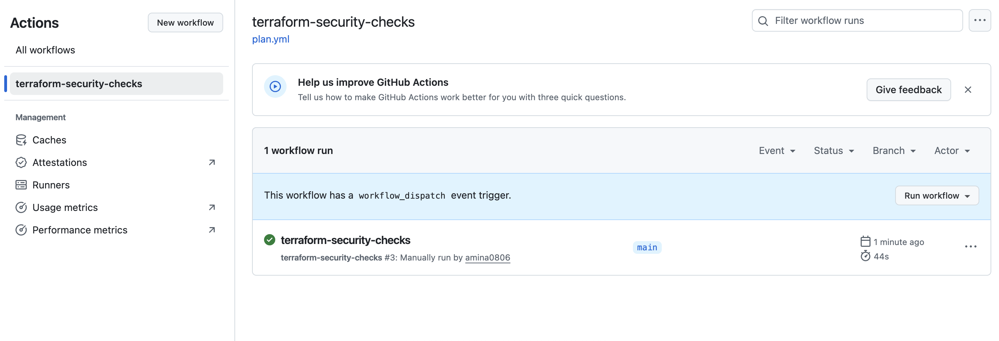

# Enterprise AWS Secure Baseline (Terraform + PaC)

This project demonstrates **how to design and enforce a secure AWS environment at enterprise scale.**
It includes:

- Multi-account setup with AWS Organizations & Service Control Policies
- Centralized logging (CloudTrail, CloudWatch, S3 + KMS)
- AWS Config Conformance Packs for compliance monitoring
- Security Hub & GuardDuty as Cloud Security Posture Management (CSPM) tools
- Policy-as-Code (OPA/Rego) to enforce encryption, IAM boundaries, and security service activation

---

## 📑 Compliance Mapping

See [Compliance Mapping Index](docs/compliance-index.md) for full coverage across **ISO/IEC 27001 (2013 & 2022)**, **CIS AWS Foundations**, **Saudi NCA ECC**, and **UAE NESA IAS**.

---

## ISO/IEC 27001 Annex A — Control Mapping (2013 → 2022)

This document shows how the **2013 Annex A controls** map into the **2022 revision**.
It demonstrates awareness of both versions — useful since many organizations are still transitioning.

---

## Step 1 — State Backend (S3 + DynamoDB)

| Implementation Example | 2013 Control (old numbering) | 2022 Control (new numbering) |
|-------------------------|------------------------------|------------------------------|
| S3 backend with SSE-KMS | A.8.20 Use of cryptography | 8.24 Use of cryptography |
| Remote state segregation (multi-account, Org) | A.8.23 Information security in cloud services | 5.23 Information security for use of cloud services |
| DynamoDB state locking (Terraform state protection) | A.8.16 Access control | 5.15 Access control |

---

## Step 2 — Centralized Logging

| Implementation Example | 2013 Control | 2022 Control |
|-------------------------|--------------|--------------|
| CloudTrail & CloudWatch logging | A.12.4 Logging and monitoring | 8.15 Logging |
| CMK for encryption (KMS) | A.8.20 Use of cryptography | 8.24 Use of cryptography |
| Block Public Access, TLS-only | A.8.24 Data leakage prevention | 8.12 Data leakage prevention |
| Log file validation, versioned bucket | A.8.16 Monitoring activities | 8.16 Monitoring activities |

---

## Step 3 — AWS Config & Conformance Packs

| Implementation Example | 2013 Control | 2022 Control |
|-------------------------|--------------|--------------|
| AWS Config rules baseline | A.12.1 Security requirements of IS | 5.14 Information security requirements for information systems |
| Conformance pack compliance checks | A.18.2.2 Compliance with security policies & standards | 5.36 Compliance with policies, rules and standards for information security |
| Continuous compliance evaluation | A.12.7 Information systems audit considerations | 5.35 Independent review of information security |
| Resource compliance monitoring | A.8.16 Monitoring activities | 8.16 Monitoring activities |

---

## Step 4 — Security Hub, GuardDuty & Policy-as-Code

| Implementation Example | 2013 Control | 2022 Control |
|-------------------------|--------------|--------------|
| Security Hub findings aggregation | A.12.4 Logging & monitoring | 8.15 Logging |
| GuardDuty threat detection | A.12.6 Technical vulnerability management | 8.8 Management of technical vulnerabilities |
| Incident dashboard & response | A.16.1 Information security incident management | 5.25 Response to information security incidents |
| GuardDuty anomalous network alerts | A.13.1 Network security management | 8.20 Network security |
| Policy-as-Code enforcement in CI/CD | A.14.2 Security in development and support processes | 8.28 Secure coding |
| Security Hub standards (shared responsibility) | A.15.1 Information security in supplier relationships | 5.22 Information security in supplier relationships |

---
## Step 5 — OPA Policy-as-Code (Terraform Plan Evaluation)

| Implementation Example | 2013 Control (old numbering) | 2022 Control (new numbering) |
|-------------------------|-------------------------------|-------------------------------|
| GuardDuty enforcement via OPA (deny if missing) | A.12.6 Technical vulnerability management | 8.8 Management of technical vulnerabilities |
| Security Hub enforcement via OPA (deny if missing) | A.12.4 Logging & monitoring | 8.15 Logging |
| CIS/AFSBP standards subscription required | A.18.2.2 Compliance with security policies & standards | 5.36 Compliance with policies, rules and standards for information security |
| IAM principals must have permission boundaries | A.9.2.3 Management of privileged access rights | 5.18 Privileged access rights |
| S3 encryption required (SSE-KMS) | A.8.20 Use of cryptography | 8.24 Use of cryptography |
| Policy-as-Code unit tests (`opa test`) validate rules | A.12.1.2 Change management | 5.14 Information security requirements for information systems |
| GitHub Actions runs `opa test` in CI (portfolio mode) | A.18.2.3 Technical compliance review | 5.35 Independent review of information security |

---

## Step 6 — AWS Organizations & SCPs (Preventive Guardrails)

| Implementation Example | 2013 Control (old numbering) | 2022 Control (new numbering) |
|-------------------------|------------------------------|------------------------------|
| Deny leaving the organization (DenyLeaveOrg SCP) | A.6.1.1 Information security roles & responsibilities | 5.2 Information security roles and responsibilities |
| Protect Security Services (deny disabling CloudTrail, Config, GuardDuty, Security Hub) | A.12.4 Logging & monitoring | 8.15 Logging |
| Restrict use of non-approved AWS regions | A.9.1.2 Access to networks and network services | 5.12 Classification and handling of information |
| Require MFA for IAM write actions (toggle) | A.9.2.3 Management of privileged access rights | 5.18 Privileged access rights |
| Deny all for root account (toggle, break-glass only) | A.9.2.1 User registration and de-registration | 5.17 Identity management |
| Organization-wide governance with SCPs | A.5.1.1 Policies for information security | 5.1 Policies for information security |
| Terraform-managed multi-account OUs and policies | A.12.1.2 Change management | 5.14 Information security requirements for information systems |

📄 Full mappings:
- [docs/iso27001-mapping.md](docs/iso27001-mapping.md)
- [docs/cis-controls-coverage.md](docs/cis-controls-coverage.md)
- [docs/nca-ecc-mapping.md](docs/nca-ecc-mapping.md)
- [docs/nesa-mapping.md](docs/nesa-mapping.md)

---
## Project Steps & Locations

| Step | Purpose                          | Primary code locations                           | Proofs (screenshots)                    |
|-----:|----------------------------------|---------------------------------------------------|-----------------------------------------|
| 1    | State backend (S3+DDB, KMS)      | envs/dev/step1-state.tf, modules/state/*         | docs/screenshots/step1_*                |
| 2    | Logging (CloudTrail, CW, KMS)    | envs/dev/step2-logging.tf, modules/logging/*     | docs/screenshots/step2_*                |
| 3    | Config & Conformance             | envs/dev/step3-conformance.tf, envs/dev/conformance/step3-custom.yaml | docs/screenshots/step3_* |
| 4    | Security Hub & GuardDuty         | envs/dev/step4-security.tf, modules/security/*   | docs/screenshots/step4_*                |
| 5    | Policy-as-Code (OPA/Rego)        | policies-as-code/opa/**                          | docs/screenshots/step5_*                |
| 6    | Organizations & SCPs (optional)  | envs/dev/step6-org-scps.tf, modules/org/scps/**  | docs/screenshots/step6_*                |

---

**Architecture Diagram**
`docs/architecture-diagram.png`

---

 **Project Structure**

---
 

# Step 1 — Remote State Backend
- **S3 bucket (SSE-KMS, versioning enabled)** for Terraform state storage
- **DynamoDB table** for state locking and consistency

---

### Screenshots

| Step | Screenshot |
|------|------------|
| ✅ S3 Backend Bucket (SSE-KMS + Versioning) |  |
| ✅ DynamoDB Table for State Locking |  |

---

### Security Highlights

- **Centralized remote state** → Terraform state stored in secure S3 bucket.
- **Integrity & consistency** → DynamoDB table prevents concurrent state changes.
- **Encrypted at rest** → Backend bucket encrypted with AWS KMS CMK.
- **Versioning enabled** → Rollback and tamper detection for state files.
- **Least privilege IAM** → Access to state backend scoped to pipeline role only.

---

### ISO/IEC 27001 Annex A Mapping

- **A.8.20 Use of cryptography** → State backend encrypted with KMS.
- **A.12.4 Logging & monitoring** → State versioning supports auditability.
- **A.5.23 Cloud security** → Enforced remote backend instead of local state.
- **A.8.16 Identity & access control** → IAM policies restrict access to state bucket/DDB.

---

### Saudi Arabia- NCA ECC (Essential Cybersecurity Controls) Mapping

- **ECC-1.2 Data Protection at Rest** → S3 backend encryption with KMS.
- **ECC-1.6 Secure Configuration Management** → Remote state ensures centralized control.
- **ECC-5.1 Access Control** → Scoped IAM policies on state bucket and DDB.
- **ECC-6.2 Audit Logging** → Versioning provides history of changes.

---
 

# Step 2 — Centralized Logging
- **CloudTrail (multi-region, global events, log file validation)**
- **S3 log bucket** (versioned, SSE-KMS CMK, Block Public Access, TLS-only policy)
- **CloudWatch Logs group** (KMS-encrypted, retention 365 days)

---

### Screenshots

| Step | Screenshot |
|------|------------|
| ✅ KMS CMK Created (Rotation Enabled) |  |
| ✅ Log Bucket Encryption (SSE-KMS) |  |
| ✅ S3 Block Public Access ON |  |
| ✅ Log Bucket Policy (TLS-only + enforce KMS) |  |
| ✅ CloudTrail Settings (Multi-Region, Validation, KMS) |  |
| ✅ CloudTrail Log Files in S3 (Proof) |  |

---

### Security Highlights

- **Organization-wide audit trail** → CloudTrail multi-region enabled.
- **Tamper-proof logging** → Log file validation + SSE-KMS encryption.
- **Centralized evidence storage** → S3 log bucket with versioning and lifecycle.
- **Defense in depth** → TLS-only bucket policy and enforced KMS key usage.
- **Default deny** → Block Public Access prevents accidental exposure.

---

### ISO/IEC 27001 Annex A Mapping

- **A.12.4 Logging & monitoring** → CloudTrail captures all management events.
- **A.8.20 Use of cryptography** → Logs encrypted with KMS CMK.
- **A.8.24 Data leakage prevention** → TLS-only + BPA policies on log bucket.
- **A.5.23 Cloud security** → Centralized, immutable audit logs.
- **A.8.16 Identity & access control** → Access scoped by IAM & bucket policies.

---

### Saudi Arabia - NCA ECC (Essential Cybersecurity Controls) Mapping

- **ECC-1.2 Data Protection at Rest** → CloudTrail logs encrypted with KMS.
- **ECC-1.3 Data Protection in Transit** → TLS-only bucket policy.
- **ECC-3.1 Security Logging** → Multi-region CloudTrail with validation.
- **ECC-3.2 Log Protection** → S3 versioning + lifecycle + KMS key rotation.
- **ECC-5.1 Access Control** → Bucket policies restrict access to CloudTrail + account root.

---
 

# Step 3 — AWS Config + Conformance Pack

This step extends the secure baseline with **continuous compliance monitoring**.
We enable **AWS Config** (recorder + delivery channel) and deploy a **starter Conformance Pack** containing 11 AWS-managed rules.

---

## What this proves

I can design and document an environment that not only enables secure logging (Step 2) but also **monitors compliance continuously** across accounts and regions.
This provides evidence for **security governance** and **cloud compliance frameworks** (ISO 27001, NCA ECC, UAE NESA).

---

### Screenshots

| Step | Screenshot |
|------|------------|
| ✅ Config Recorder Enabled |  |
| ✅ Delivery Channel Created |  |
| ✅ Config Settings (record all resources + include global types) |  |
| ✅ Config Rules Evaluations |  |
| ✅ Conformance Pack (starter-dev, Create complete) |  |
| ✅ Conformance Pack via CLI |  |
| ✅ S3 Delivery Bucket (AWSLogs/<acct>/Config/) |  |
| ✅ S3 Conformance Artifacts Bucket (artifacts/AWSLogs/<acct>/Config/) |  |

---

## Security Highlights

- **AWS Config Recorder**: captures configuration changes for all supported resources, including global types.
- **Centralized Delivery Buckets**:
  - `baseline-config-delivery-<acct>-<region>` → stores configuration history & snapshots.
  - `awsconfigconforms-...` → stores Conformance Pack artifacts.
- **Service-Linked Roles**: ensure AWS Config + Conformance Packs can deliver securely with least privilege.
- **Conformance Pack (starter)**: 11 rules enforcing security baselines:
  - IAM password policy (≥14 chars)
  - Root account MFA enabled
  - Access keys rotated (≤90 days)
  - CloudTrail enabled
  - VPC Flow Logs enabled
  - EBS encryption by default
  - Attached volumes encrypted
  - RDS storage encrypted
  - S3 public read prohibited
  - S3 public write prohibited
  - S3 server-side encryption enabled

---

## Compliance Mapping

**ISO/IEC 27001:2013 (Annex A)**

| Control | Description | Implementation Evidence |
|---------|-------------|--------------------------|
| **A.12.4** | Logging and monitoring | Config records all resource changes; Conformance Pack enforces logging standards (CloudTrail, VPC Flow Logs). |
| **A.8.20** | Use of cryptography | Rules check for encryption at rest (EBS, RDS, S3 SSE). |
| **A.8.23** | Information security in cloud services | Continuous monitoring of cloud resources and policies. |
| **A.8.16** | Monitoring activities | Config continuously evaluates compliance against rules. |
| **A.18.2.3** | Technical compliance review | Conformance Pack provides automated compliance assessment. |

---

**Saudi Arabia — NCA Essential Cybersecurity Controls (ECC)**

| Domain | Control | Implementation Evidence |
|--------|---------|--------------------------|
| **OAM-06** | Configuration management | AWS Config records and evaluates all resource changes. |
| **OAM-08** | Security baselines | Conformance Pack rules enforce baselines for encryption, logging, and access controls. |
| **DPS-01** | Data protection (encryption) | Rules require EBS, RDS, and S3 encryption. |
| **LMP-04** | Log management | Rules ensure CloudTrail and VPC Flow Logs are enabled and delivered securely. |
| **IAM-03** | Identity hardening | Rules enforce IAM password policies, MFA on root, and key rotation. |

---

**UAE — NESA / IAS Compliance**

| Domain | Requirement | Implementation Evidence |
|--------|-------------|--------------------------|
| **Information Systems Security** | Secure configuration baseline | AWS Config monitors drifts and applies baseline rules. |
| **Data Protection** | Encryption of sensitive data | Rules enforce S3, RDS, and EBS encryption. |
| **Audit & Accountability** | Logging of security events | CloudTrail & VPC Flow Log checks ensure audit trails. |
| **Access Control** | Credential hygiene | Rules require password complexity, MFA, and key rotation. |
| **Monitoring & Compliance** | Continuous assurance | Conformance Pack provides real-time compliance posture. |

---

 

# Step 4 — Security Services (CSPM + Threat Detection)

This step enables **AWS native CSPM and threat detection** services:

- **Security Hub** with CIS AWS Foundations (v1.4.0) and AWS Foundational Security Best Practices (v1.0.0) standards.
- **GuardDuty** detector with **S3 Protection** and **EC2 Malware Protection (EBS volumes)** enabled.
- Policy-as-Code (OPA/Rego) rules enforce that Security Hub and GuardDuty **must be enabled** in every Terraform plan.

---

### Security Highlights (Terraform)
- `aws_securityhub_account` turns on Security Hub (CSPM engine).
- `aws_securityhub_standards_subscription` attaches CIS + AFSBP standards.
- `aws_guardduty_detector` enables GuardDuty with required datasources.
- Variables exposed for version pinning (so you can adjust CIS/AFSBP versions easily).
- Tags applied consistently for audit & compliance.

---

###  Policy-as-Code (OPA/Rego)
OPA rules under `policies-as-code/opa/rules/require-security-services.rego`:
- Deny if Security Hub is missing.
- Deny if GuardDuty is missing/disabled.
- Deny if GuardDuty S3 protection or Malware Protection is off.
- Deny if CIS or AFSBP standards not subscribed.

OPA unit tests in `policies-as-code/opa/tests/` validate these rules.

---

### Screenshots

| Proof | Screenshot |
|-------|------------|
| ✅ Security Hub summary (enabled) |  |
| ✅ CIS standard enabled (v1.4.0) |  |
| ✅ AFSBP standard enabled (v1.0.0) |  |
| ✅ GuardDuty detector ON (with S3 + Malware Protection) |  |
| ✅ OPA gate denial (Security Hub missing test) |  |

---

### Compliance Mapping

- **ISO/IEC 27001 (Annex A)**
  - A.12.4 Logging & monitoring → continuous posture findings.
  - A.5.23 Cloud security (monitoring & detection).

- **CIS AWS Foundations**
  - Directly enforced via Security Hub CIS standard.

- **Regional**
  - **Saudi NCA ECC**: D5.5 Threat detection (GuardDuty), D1/D2 Logging + config compliance.
  - **UAE NESA/IAS**: Security Monitoring, Threat/Vulnerability Management, Governance.

---
 

# Step 5 — Policy-as-Code (OPA / Rego)

This step integrates **Policy-as-Code (PaC)** into the secure baseline using **Open Policy Agent (OPA)** and Rego rules.
Terraform plans are evaluated against mandatory guardrails before apply, ensuring that misconfigurations such as missing Security Hub or GuardDuty detectors are automatically denied.
This enforces **continuous compliance** and prevents insecure infrastructure from being provisioned.

In addition, I configured a lightweight **CI workflow (`plan.yml`)** that automatically runs `terraform validate`, `tfsec`, `Checkov`, and `opa test` on every commit in **portfolio mode** (no AWS writes).
A **green CI badge** is displayed at the top of the repository to demonstrate awareness of modern DevSecOps practices and provide a quick visual indicator of pipeline health.

---

### Terraform & OPA Highlights

- **OPA policies** under `policies-as-code/opa/rules/` enforce:
  - Deny if **GuardDuty detector** is missing or disabled.
  - Deny if **Security Hub account** is not enabled.
  - Deny if **Security Hub standards (CIS / AFSBP)** are not subscribed.
  - Deny if **IAM principals** are missing permission boundaries.
  - Deny if **S3 buckets** are not encrypted with SSE.
- **OPA unit tests** under `policies-as-code/opa/tests/` validate all Rego rules (`opa test`).
- **OPA eval** runs on Terraform plan JSON to show clear violation messages.
- **CI pipeline** (`.github/workflows/plan.yml`) runs Terraform + tfsec + Checkov + OPA checks.
- **CI badge** in README shows passing status (green), adding a visible compliance “edge.”

---

### Compliance Mapping

- **ISO/IEC 27001 (Annex A)**
  - A.12.1.2 Change management → security enforced at plan stage.
  - A.12.4 Logging & monitoring → continuous compliance validation.
  - A.18.2.3 Technical compliance review → automated checks using OPA.

- **CIS AWS Foundations**
  - Enforced through Security Hub CIS benchmark subscription.

- **Regional**
  - **Saudi NCA ECC**: D5.5 Threat detection (GuardDuty), D1/D2 Logging & compliance monitoring, CC-06 Compliance checks.
  - **UAE NESA/IAS**: Security Monitoring, Threat & Vulnerability Management, Compliance & Audit governance.

---

### Screenshots

| Proof | Screenshot |
|-------|------------|
| ❌ OPA eval failure when GuardDuty is missing |  |
| ❌ OPA eval failure when Security Hub is missing |  |
| ✅ OPA unit tests (10/10 pass) |  |
| ✅ OPA eval pass (all checks satisfied) |  |
| ✅ CI badge (green) in README |  |
| ✅ GitHub Actions run (plan.yml) passing all checks |  |
---

 

# Step 6 — AWS Organizations & Service Control Policies (SCPs)

This step introduces **AWS Organizations** and **Service Control Policies (SCPs)** to enforce **preventive guardrails** across all accounts in the organization. Unlike detective controls (Config rules, Security Hub) or reactive monitoring (CloudTrail/GuardDuty), SCPs ensure that certain risky or non-compliant actions cannot even be attempted.

---

## What this proves

- I can design and deploy **multi-account guardrails** at the **organization root level**.
- I can **restrict regions** so workloads only run in approved geographies (e.g., `us-east-1`).
- I can **protect critical security services** (CloudTrail, Config, GuardDuty, Security Hub) from being disabled or tampered with.
- I can **enforce least privilege** across accounts using SCPs that apply consistently to OUs or the root.
- I can demonstrate the **preventive control layer** required by ISO 27001 and regional frameworks (Saudi NCA ECC, UAE NESA IAS).
- Terraform module design: enabled toggles (`enable_protect_security_services`, `enable_require_mfa_iam`, `enable_deny_root_user`) show awareness of safe defaults and controlled “flip points” for stricter guardrails later.

---

## Screenshots

| Proof | Screenshot |
|-------|------------|
| ✅ Organization **All features enabled** |  |
| ✅ Root has **SCPs attached** |  |
| ✅ OUs created (`infra`, `sandbox`, `security`, `workloads`) |  |
| ✅ Protect Security Services policy (JSON deny for CloudTrail, Config, GuardDuty, Security Hub) |  |
| ✅ Restrict Regions policy (JSON deny with `aws:RequestedRegion` condition) |  |
| ✅ Terraform outputs showing Org ID, Root ID, OU IDs, Policy ARNs |  |

---

## Compliance Mapping

- **ISO/IEC 27001:2013 (Annex A)**-

  - A.5.1.1 Policies for information security → Organization-wide SCPs establish mandatory security rules.
  - A.9.1.2 Access to networks and network services → RestrictRegions SCP enforces approved geographies.
  - A.12.1.2 Change management → Preventive guardrails stop unauthorized configuration changes (e.g., disabling CloudTrail).
  - A.12.4 Logging & monitoring → SCPs enforce continuous logging by denying stop/delete of CloudTrail, Config, GuardDuty, Security Hub.
  - A.18.2.3 Technical compliance review → Guardrails act as a compliance baseline, preventing violations before they occur.

- **CIS AWS Foundations**-

  - 1.1 Ensure CloudTrail is enabled in all regions → Protected by `ProtectSecurityServices` SCP.
  - 1.2 Ensure no unauthorized regions are used → `RestrictRegions` SCP enforces this.
  - 1.5 Ensure configuration changes are logged and monitored → Config recorder cannot be disabled.

- **Saudi Arabia — NCA Essential Cybersecurity Controls (ECC)**-

  - D5.2 Identity and Access Management → Require MFA for IAM (toggle, can be enforced later).
  - D5.5 Threat detection → GuardDuty cannot be disabled
  - D1/D2 Logging & monitoring → CloudTrail/Config cannot be disabled.
  - CC-06 Compliance checks → SCPs enforce baseline governance across all accounts.

- **UAE — NESA / IAS Compliance**-

  - Security Monitoring & Governance → CloudTrail/Config logs enforced at org level.
  - Threat & Vulnerability Management → GuardDuty enforced.
  - Compliance & Audit Governance → SCPs provide preventive assurance that policies are followed across the enterprise.

---

## Highlights

- **Preventive guardrails** complement detective controls (Config rules, Security Hub).
- **Terraform modular design** with toggles allows gradual enforcement (safe defaults now, stricter later).
- **Cloud Security Architecture maturity** → Moving from single-account security to **multi-account governance** at the organizational level.
- **Auditable proof**: Both Terraform outputs and AWS Console screenshots show SCPs applied and effective.
