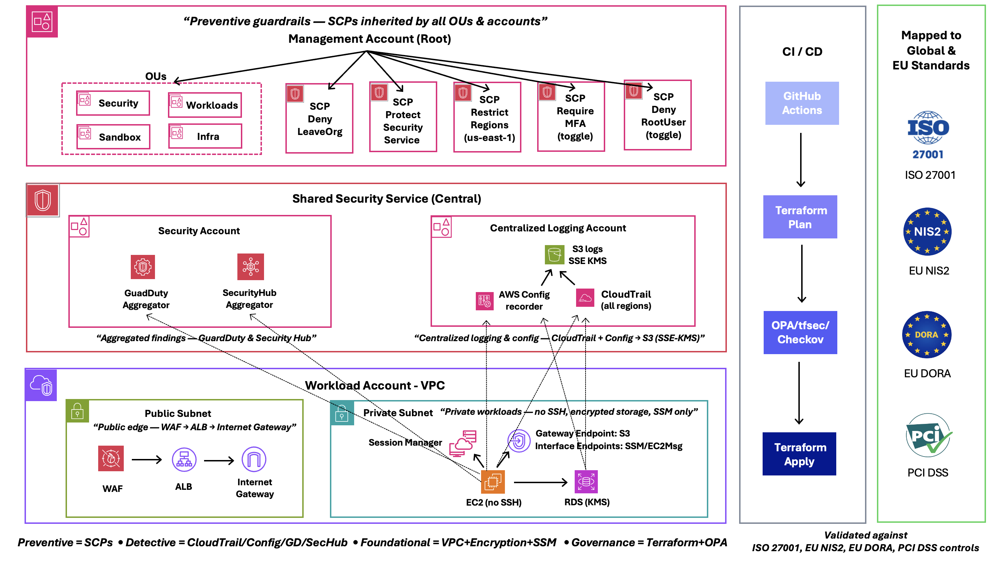
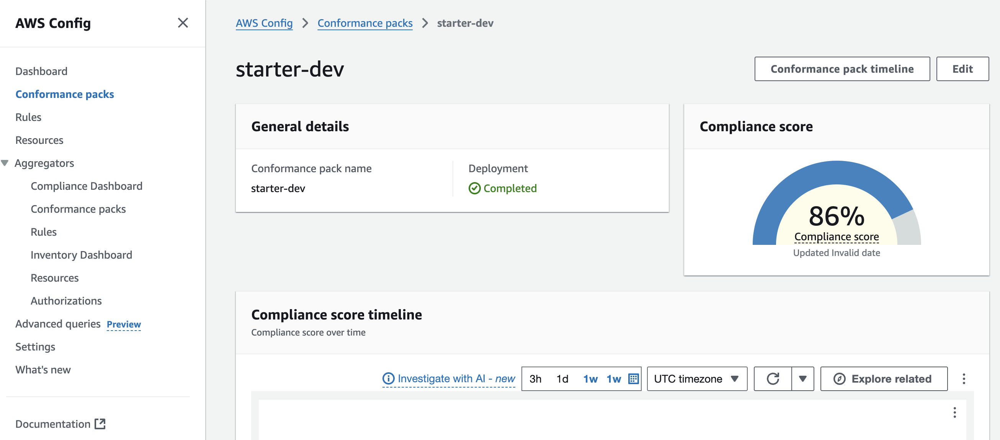
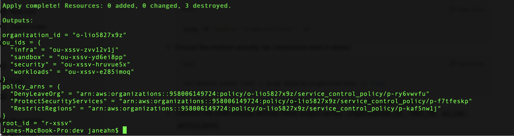

[](https://github.com/amina0806/terraform-aws-security-multi-account/actions/workflows/plan.yml)
# Enterprise AWS Secure Baseline (Terraform + PaC)

This project demonstrates **how to design and enforce a secure AWS environment at enterprise scale.**
It includes:

- Multi-account setup with AWS Organizations & Service Control Policies
- Centralized logging (CloudTrail, CloudWatch, S3 + KMS)
- AWS Config Conformance Packs for compliance monitoring
- Security Hub & GuardDuty as Cloud Security Posture Management (CSPM) tools
- Policy-as-Code (OPA/Rego) to enforce encryption, IAM boundaries, and security service activation

---

## Table of Contents
- [Features](#features)
- [Deployment](#deployment)
- [Audit Checklist](docs/audit-checklist.md)
- [Compliance Mapping](#compliance-mapping)
- [Architecture](#architecture-diagram)
- [Project Structure](#project-structure)
- [Detailed Steps & Evidence](#detailed-steps--evidence)
  - [Step 1 — Remote State Backend (Detailed Evidence)](#step-1--remote-state-backend-detailed-evidence)
  - [Step 2 — Centralized Logging (Detailed Evidence)](#step-2--centralized-logging-detailed-evidence)
  - [Step 3 — AWS Config & Conformance Pack (Detailed Evidence)](#step-3--aws-config--conformance-pack-detailed-evidence)
  - [Step 4 — Security Services (CSPM + Threat Detection) (Detailed Evidence)](#step-4--security-services-cspm--threat-detection-detailed-evidence)
  - [Step 5 — Policy-as-Code (OPA/Rego) (Detailed Evidence)](#step-5--policy-as-code-oparego-detailed-evidence)
  - [Step 6 — AWS Organizations & SCPs (Detailed Evidence)](#step-6--aws-organizations--scps-detailed-evidence)
- [CI/CD & Security Gates](#cicd--security-gates)
- [Inputs & Variables](#inputs--variables)
- [Troubleshooting](#troubleshooting)
- [Contact](#contact)


---

### Features
- **AWS Organizations + SCPs**: region restriction, deny root, protect security services, require MFA for IAM writes.
- **Centralized Logging**: CloudTrail (multi-region, validation), KMS-encrypted S3 log bucket, CloudWatch Logs.
- **Continuous Compliance**: AWS Config + starter Conformance Pack.
- **CSPM + Threat Detection**: Security Hub (CIS + AFSBP), GuardDuty (S3 Protection + Malware Protection).
- **Policy-as-Code**: OPA/Rego checks on Terraform **plan.json** + tfsec + Checkov.
- **Evidence-first**: curated screenshots & outputs managers can audit quickly.
- **Extensible to Azure/GCP environments**: Easily adaptable to Azure/GCP with minor adjustments.

---

## Deployment

This baseline supports multiple environments (e.g., `dev`, `prod`) using **remote state + locking** and **pre-apply security validation**.

### 1) Prerequisites
- **AWS CLI** with admin role/session (**MFA recommended**).
- **Terraform v1.6+** locally or in CI.
- **Remote state backend** (one-time):
  > For regions **other than `us-east-1`**, add: `--create-bucket-configuration LocationConstraint=<region>`

```bash
aws s3api create-bucket --bucket amina-tf-state --region us-east-1
aws dynamodb create-table \
  --table-name amina-tf-locks \
  --attribute-definitions AttributeName=LockID,AttributeType=S \
  --key-schema AttributeName=LockID,KeyType=HASH \
  --billing-mode PAY_PER_REQUEST

```

### 2) Initialize environment

```bash
cd envs/dev
terraform init \
  -backend-config="bucket=amina-tf-state" \
  -backend-config="dynamodb_table=amina-tf-locks" \
  -backend-config="key=dev/terraform.tfstate" \
  -backend-config="region=us-east-1"
```


### 3) Plan & validate (security gates)

```bash
terraform plan -out=tfplan
terraform show -json tfplan > plan.json

tfsec .
checkov -d .
opa eval -d ../../policies-as-code/opa -i plan.json "data.terraform.security.deny"
```


### 4) Apply the reviewed plan

```bash
terraform apply tfplan
```


### 5) Verify key outcomes

- **Organizations**: OUs present, SCPs attached to Root/OU/accounts.

- **CloudTrail**: multi-region, KMS-encrypted, log file validation enabled.

- **Security Hub / GuardDuty**: enabled and  aggregated; CIS + AFSBP subscribed.

- **IAM**: root restricted; MFA requirement for IAM writes.

- **Config + Conformance Pack**: rules evaluating and reporting.

---
- **Security Notes**
---
    - Remote state encrypted (KMS) + DynamoDB locking

    - SCPs prevent disabling CloudTrail/Config/GuardDuty/Security Hub

    - All logs encrypted (SSE-KMS) and versioned

    - Plans fail fast on tfsec/Checkov/OPA violations


---

## Audit Checklist

Full details (with screenshots + ISO mappings) → [Audit Checklist](docs/audit-checklist.md)


| Step | Area                         | Controls Verified                          | Evidence |
|------|------------------------------|--------------------------------------------|----------|
| 1    | Remote State (S3 + DynamoDB) | SSE-KMS, versioning, state locking          | [View](docs/audit-checklist.md#step-1--remote-state-s3--dynamodb) |
| 2    | Centralized Logging          | Org-wide CloudTrail, encrypted log bucket   | [View](docs/audit-checklist.md#step-2--centralized-logging) |
| 3    | Config & Conformance Packs   | Config recorder + conformance pack          | [View](docs/audit-checklist.md#step-3--aws-config--conformance-packs) |
| 4    | Security Hub & GuardDuty     | Standards enabled, Org aggregation          | [View](docs/audit-checklist.md#step-4--security-hub--guardduty) |
| 5    | Policy-as-Code               | tfsec, Checkov, OPA evaluation              | [View](docs/audit-checklist.md#step-5--policy-as-code-oparego-tfsec-checkov) |
| 6    | Organizations & SCPs         | OU structure, Region/Service guardrails     | [View](docs/audit-checklist.md#step-6--aws-organizations--scps) |


---

## Compliance Mapping

| AWS Control          | AWS Service          | ISO/IEC 27001:2022         | NIST CSF             | PCI DSS                  | NIS2 (Art. 21 / 23)                          | DORA (Art. 8 / 23 / 30)                    |
|----------------------|----------------------|----------------------------|----------------------|--------------------------|---------------------------------------------|---------------------------------------------|
| Centralized logging  | CloudTrail + KMS     | 8.15 Logging & monitoring  | DE.AE-3, DE.CM-7     | Req. 10.5, 10.6          | Art. 21(2)(d) Event logging & monitoring    | Art. 8 Monitoring & detection, Art. 23 Incident reporting |
| Encryption at rest   | KMS CMKs             | 8.24 Cryptography          | PR.DS-1, PR.DS-5     | Req. 3.4, 3.5            | Art. 21(2)(f) Cryptography & encryption     | Art. 8 Data protection & encryption         |
| Access control       | IAM MFA + SCPs       | 5.18 Privileged access rights | PR.AC-1, PR.AC-4  | Req. 7.1, 8.3            | Art. 21(2)(b) Access control & asset mgmt   | Art. 8 Access management (MFA, PIM, SCPs)  |
| Secure by design     | Terraform + OPA      | 5.36 Secure dev lifecycle, 8.8 Technical review | ID.RA-1, PR.IP-3 | Req. 6.3, 6.5            | Art. 21(2)(c) Risk assessment, 21(2)(g) Incident handling | Art. 8 ICT risk management, Art. 30 Third-party risk management |


📄 **Full mapping** → [docs/compliance-index.md](docs/compliance-index.md)

---

## Architecture Diagram




---
**Key Components**
- AWS Organizations with multiple OUs (security, workloads, infra, sandbox).
- Service Control Policies (SCPs) to enforce guardrails.
- Centralized CloudTrail with KMS encryption + log file validation.
- Organization-wide GuardDuty and Security Hub enabled.
- IAM hardening: MFA enforcement, permission boundaries, deny root user.
- Modular Terraform structure with `dev` and `prod` environments.

---
## Project Steps & Locations

| Step | Purpose                          | Primary code locations                           | Proofs (screenshots)                    |
|-----:|----------------------------------|---------------------------------------------------|-----------------------------------------|
| 1    | State backend (S3+DDB, KMS)      | envs/dev/step1-state.tf, modules/state/*         | docs/screenshots/step1_*                |
| 2    | Logging (CloudTrail, CW, KMS)    | envs/dev/step2-logging.tf, modules/logging/*     | docs/screenshots/step2_*                |
| 3    | Config & Conformance             | envs/dev/step3-conformance.tf, envs/dev/conformance/step3-custom.yaml | docs/screenshots/step3_* |
| 4    | Security Hub & GuardDuty         | envs/dev/step4-security.tf, modules/security/*   | docs/screenshots/step4_*                |
| 5    | Policy-as-Code (OPA/Rego)        | policies-as-code/opa/**                          | docs/screenshots/step5_*                |
| 6    | Organizations & SCPs (optional)  | envs/dev/step6-org-scps.tf, modules/org/scps/**  | docs/screenshots/step6_*                |


---


## Project Structure

```

tf-aws-secure-baseline/
├── modules/                 # Reusable Terraform modules (state, logging, security, network, etc.)
├── envs/                    # Environment configurations (dev, prod)
├── policies-as-code/        # OPA/Rego rules, tfsec & Checkov configs
├── .github/workflows/       # CI/CD pipelines (plan/apply, security checks)
├── docs/                    # Architecture diagrams, compliance mappings, study notes
│   ├── diagrams/
│   ├── screenshots/
│   └── compliance/
├── providers.tf             # Terraform providers
├── variables.tf             # Global variables
├── outputs.tf               # Global outputs
└── main.tf                  # Root configuration entrypoint

```


---


## Detailed Steps & Evidence


## Step 1 — Remote State Backend (Detailed Evidence)

## What this proves
- I can design a **secure Terraform backend** that enforces centralized state storage, locking, encryption, and auditability.
- Ensures **integrity of Infrastructure-as-Code** and meets ISO/NCA requirements for secure configuration.

---

### Screenshots

| Proof | Screenshot |
|------|------------|

| ✅ S3 Backend Bucket (SSE-KMS + Versioning) |  |
| ✅ DynamoDB Table for State Locking |  |

---

### Security Highlights
- Centralized **remote state** in S3
- DynamoDB lock prevents concurrent changes
- **Encrypted at rest** (KMS CMK)
- Versioning enabled → rollback + tamper detection
- IAM least-privilege access to backend

---
### Compliance Mapping

- **NIS2 (Article 21 / 23)**
  - Art. 21(2)(b): Access control & asset management
  - Art. 21(2)(d): Event logging & monitoring
  - Art. 21(2)(f): Cryptography & encryption
  - Art. 23: Incident reporting (audit-ready logs)

- **DORA (Article 8 / 30)**
  - Art. 8: ICT risk management — secure configuration, encryption, and access control
  - Art. 8: Data protection — encryption of ICT assets and state files
  - Art. 30: Third-party ICT risk management — centralized, auditable backend supports governance of outsourced ICT services

---

## Step 2 — Centralized Logging (Detailed Evidence)

## What this proves
- I can enforce **organization-wide audit trails** with CloudTrail and secure log storage.
- Logs are **tamper-proof, encrypted, and immutable** — meeting compliance and forensics needs.

---

### Screenshots

| Proof | Screenshot |
|------|------------|
| ✅ KMS CMK Created (Rotation Enabled) |  |
| ✅ Log Bucket Encryption (SSE-KMS) |  |
| ✅ S3 Block Public Access ON |  |
| ✅ TLS-only Bucket Policy |  |
| ✅ CloudTrail Multi-Region Enabled |  |
| ✅ CloudTrail Logs in S3 |  |

---

### Security Highlights
- Org-wide CloudTrail (multi-region, global events)
- **Tamper-proof logs** (validation, SSE-KMS)
- S3 bucket with versioning + lifecycle mgmt
- TLS-only + Block Public Access enforced
- CloudWatch Logs KMS-encrypted

---
### Compliance Mapping

- **NIS2 (Article 21 / 23)**
  - Art. 21(2)(d): Event logging & monitoring
  - Art. 21(2)(g): Incident handling
  - Art. 23: Incident reporting (audit-ready alerts & logs)

- **DORA (Article 8 / 23)**
  - Art. 8: Monitoring & detection — continuous log collection (CloudTrail, CloudWatch)
  - Art. 23: ICT incident reporting — GuardDuty/Security Hub alerts support reporting obligations


---

## Step 3 — AWS Config + Conformance Pack (Detailed Evidence)

## What this proves
- I can implement **continuous compliance monitoring** across accounts.
- Config + Conformance Packs enforce baselines for encryption, logging, and IAM security.

---

### Screenshots

| Proof | Screenshot |
|------|------------|
| ✅ Config Recorder Enabled |  |
| ✅ Delivery Channel Created |  |
| ✅ Config Settings |  |
| ✅ Config Rules Evaluations |  |
| ✅ Conformance Pack Deployed |  |
| ✅ Conformance Pack via CLI |  |

---

### Security Highlights
- Recorder tracks **all resource changes**
- Centralized delivery buckets for evidence
- Service-linked roles for least-privilege
- Conformance Pack with 11 security baseline rules (passwords, MFA, encryption, logs)

---

### Compliance Mapping

- **NIS2 (Article 21)**
  - Art. 21(2)(a): Governance & policies
  - Art. 21(2)(c): Risk assessment

- **DORA (Article 8)**
  - Art. 8: ICT risk management — automated drift detection & compliance monitoring
  - Art. 8: Governance of ICT assets — evidence via conformance packs
---

## Step 4 — Security Services (CSPM + Threat Detection) (Detailed Evidence)

## What this proves
- I can enable **native AWS CSPM and threat detection** tools.
- Security Hub and GuardDuty enforce continuous monitoring and incident detection.

---

### Screenshots

| Proof | Screenshot |
|-------|------------|
| ✅ Security Hub Summary |  |
| ✅ CIS Standard Enabled |  |
| ✅ AFSBP Standard Enabled |  |
| ✅ GuardDuty Detector ON |  |
| ✅ OPA Deny if Security Hub Missing |  |

---

### Security Highlights
- Security Hub enabled org-wide with **CIS + AFSBP standards**
- GuardDuty with **S3 + Malware Protection**
- OPA rules enforce mandatory services
- Standards version-pinned for audit traceability

---

### Compliance Mapping
- **NIS2 (Article 21 / 23)**
  - Art. 21(2)(d): Event monitoring
  - Art. 21(2)(g): Incident handling
  - Art. 23: Incident reporting (structured alerts for deadlines)

- **DORA (Article 8 / 23)**
  - Art. 8: Monitoring & detection — continuous threat detection
  - Art. 23: ICT incident reporting — Security Hub/SIEM integration for reporting workflows

---

## Step 5 — Policy-as-Code (OPA/Rego) (Detailed Evidence)

## What this proves
- I can integrate **Policy-as-Code** in Terraform pipelines to deny insecure plans before apply.
- CI/CD enforces security continuously.

---

### Screenshots

| Proof | Screenshot |
|-------|------------|
| ⌠OPA eval fail (GuardDuty missing) |  |
| ⌠OPA eval fail (Security Hub missing) |  |
| ✅ OPA unit tests pass |  |
| ✅ OPA eval pass (all checks) |  |
| ✅ CI Badge Green |  |

---

### Security Highlights
- OPA rules for GuardDuty, Security Hub, IAM boundaries, S3 encryption
- Unit tests validate all rules (`opa test`)
- Terraform plan gated by OPA + tfsec + Checkov
- GitHub Actions pipeline with visible badge

---

### Compliance Mapping
- **NIS2 (Article 21)**
  - Art. 21(2)(c): Risk assessment — policy evaluation of Terraform plans
  - Art. 21(2)(e): Supply chain security — enforce vendor/region allowlists

- **DORA (Article 8 / 30)**
  - Art. 8: ICT risk management — CI/CD pipelines enforce secure baselines
  - Art. 30: Third-party ICT risk management — dependency scanning & SBOM checks
---

## Step 6 — AWS Organizations & SCPs (Detailed Evidence)

## What this proves
- I can enforce **preventive guardrails** at the organization level.
- SCPs ensure risky actions (like disabling CloudTrail or using unapproved regions) can’t even be attempted.

---

### Screenshots

| Proof | Screenshot |
|-------|------------|
| ✅ Org All Features Enabled |  |
| ✅ Root with SCPs Attached |  |
| ✅ OUs Created |  |
| ✅ Protect Security Services SCP |  |
| ✅ Restrict Regions SCP |  |
| ✅ Terraform Outputs |  |

---

### Security Highlights
- SCPs protect CloudTrail/Config/GuardDuty/Security Hub
- Restrict regions → enforce geo boundaries
- Optional toggles for **Require MFA** and **Deny Root**
- Terraform modular design for gradual enforcement

---

### Compliance Mapping
- **NIS2 (Article 21)**
  - Art. 21(2)(a): Governance & risk management policies
  - Art. 21(2)(b): Access control & asset management

- **DORA (Article 8 / 30)**
  - Art. 8: Governance — preventive guardrails for critical ICT assets
  - Art. 30: Third-party ICT governance — restrict use to approved regions/services

---

## CI/CD & Security Gates

- **GitHub Actions badge** shows current pipeline health.
- CI runs on PRs and pushes to `main` (adjust as needed).
- **Gates (fail-fast):** `terraform validate` → `tfsec` → `Checkov` → `opa test` (unit tests) → optional OPA eval on a sample plan.

**Minimal `plan.yml` skeleton:**
```yaml
name: terraform-security-checks

on:
  push:
    branches: [ main ]
  pull_request:

jobs:
  plan:
    runs-on: ubuntu-latest
    steps:
      - uses: actions/checkout@v4

      - name: Setup Terraform
        uses: hashicorp/setup-terraform@v3
        with:
          terraform_version: 1.6.6

      - name: Terraform Validate
        run: |
          cd envs/dev
          terraform init -backend=false
          terraform validate

      - name: tfsec
        uses: aquasecurity/tfsec-action@v1

      - name: Checkov
        uses: bridgecrewio/checkov-action@v12
        with:
          directory: .

      - name: OPA unit tests
        run: |
          opa version
          opa test policies-as-code/opa -v
```
---

## Inputs & Variables

See [docs/variables.md](docs/variables.md) for the full list of supported inputs and example `terraform.tfvars`.

---

---

## Troubleshooting

**`AWSOrganizationsNotInUseException`**
- Enable Organizations (**All features**) in the management account before applying Step 6.

---

**Security Hub/GuardDuty aggregator issues**
- Ensure delegated administrator is set (Security Hub/GuardDuty → Settings).
- Some org-level APIs require admin designation before enabling standards.

---

**OPA/Rego errors (v1 syntax)**
- Use simple set/list comprehensions; avoid deprecated helpers.
- Run unit tests locally:
  ```bash
  opa test policies-as-code/opa -v
  ```
- Ensure your opa eval path matches:
  ```bash
  opa eval -i plan.json -d policies-as-code/opa "data.terraform.security.deny"
  ```

---

**plan.json empty or missing**

   ```bash
  terraform plan -out=tfplan
  terraform show -json tfplan > plan.json
  ```

---

**Version mismatches (providers/standards)**
- Pin providers in providers.tf.
- Check Security Hub standard IDs (e.g., cis-1.4.0, afsbp-1.0.0) match your region.

---

**tfsec/Checkov missing**
- Install locally:
  ```bash
  brew install tfsec checkov
  ```
- Or use the GitHub Actions workflow included in .github/workflows/plan.yml.

---
### Contacts

**Amina Jiyu An**
Cloud Security & Compliance Engineer | Terraform • IAM/PAM • Policy-as-Code • DevSecOps |
ISO 27001 • PCI DSS • NIS2 • DORA
- LinkedIn: [linkedin.com/in/amina0806](https://www.linkedin.com/in/amina0806/)
- GitHub: [github.com/amina0806](https://github.com/amina0806)
- Email: [amina.an0806@gmail.com](mailto:amina.an0806@gmail.com)
